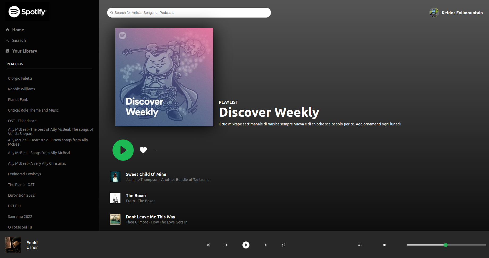

# Spotify Clone

**[Test this app yourself](https://vincenzoarena.github.io/spotify-clone/)**

---

---

### About Project

I have built a Spotify clone pulling information from the official Spotify API.

### How to use this Project

You can do the login with your Spotify account and then see your playlists in the sidebar and your "Discover Weekly" playlist in the main section of the page. The player, the volume controls and the search function will be implemented later on.

##### Developed With

- [x] _HTML5_
- [x] _CSS3_
- [ ] _SASS_
- [ ] _SCSS_
- [x] _JavaScript_
- [x] _React_
- [ ] _Bootstrap_
- [x] _npm_
- [ ] _..._

---

### Contact

Mail: <penninoematita@gmail.com> 
GitHub: [vincenzoarena](https://github.com/vincenzoarena) 
LinkedIn: [Vincenzo Arena](https://www.linkedin.com/in/vincenzo-arena-032a064b/)

---

### Used Tools

- [react-icons](https://react-icons.github.io/react-icons)
- [Tool Cool Range Slider](https://reactjsexample.com/range-slider-library-written-in-typescript-and-using-web-component-technologies/)
- [npm](https://www.npmjs.com/)
- [Google Fonts](https://fonts.google.com/)
- [Visual Studio Code](https://code.visualstudio.com/)